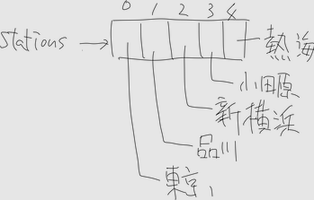
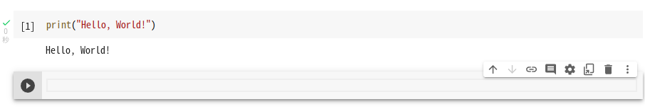

# Python 実習

## はじめに

今回の導入教育では python の基本的な構文や文法について学習する．開発環境は GoogleColaboratory(Colab) を使用する．Colab の使い方は [Python 実行環境セットアップ](#付録) を参照してください．

## 基礎

### 文字列

Python では, 文章や人名といったの文字からなるデータを, **文字列(string)** という.
文字列をソースコードに書くには`"`(ダブルクォーテーション)または`'`(シングルクォーテーション)で囲んで記述する．また文字列は間に「+」を入力することで結合することができる．次の例では文字列を`print`関数を用いて出力している.

`print`関数は, 引数として指定した値を画面に出力する.

```py
print("python実習")
print('Lorem ipsum dolor sit amet, consectetur adipiscing elit')
print('left' + ' ' + "right")
```

```
python実習
Lorem ipsum dolor sit amet, consectetur adipiscing elit
left right
```

### 数値

数値は Python で四則計算などを行う場合に使用される．数値は文字列のように`"`や`'`で囲む必要はない．

```py
print(1 + 3) # 足し算
print(1 - 3) # 引き算
print(1 * 3) # かけ算
print(1 / 3) # 割り算
print(1 % 3) # 余り
print(2 ** 3) # べき乗
```

```
4
-2
3
0.3333333333333333
1
8
```

### 変数

変数とは値を格納する場所であり，数値やデータなどを格納することができる．次の例では変数`x`, `y`にそれぞれ値を代入して`print`関数で出力している

```py
x = 8
y = "python実習"
print(x)
print(y)
```

```
8
python実習
```

### データ型

Python では, これまで紹介してきたような, 整数や実数, 文字列などのデータのことを, **オブジェクト(Object)** という用語で呼ぶ.

オブジェクトには, 整数や実数など, いろいろな種類がある.オブジェクトの種類のことを, **データ型**と呼ぶ.

例えば数字の`2`は, **整数型のオブジェクト**, 文字列の`abc`は, **文字列型のオブジェクト** という呼び方をする.

以下に Python の主なデータ型を示す.

| データ型     | 説明                                                                                                                                                                                          | 記述例                                               |
| ------------ | --------------------------------------------------------------------------------------------------------------------------------------------------------------------------------------------- | ---------------------------------------------------- |
| `str`        | 文字列                                                                                                                                                                                        | `str = 'abc'`                                        |
| `int`        | 小数点を含まない数値                                                                                                                                                                          | `num = 6`                                            |
| `float`      | 小数点を含む数値                                                                                                                                                                              | `num = 3.14`                                         |
| `bool`       | 真偽値                                                                                                                                                                                        | `check_flag = True`                                  |
| `datetime`   | 日付                                                                                                                                                                                          | `date1 = datetime.datetime(2020, 1, 31, 12, 36, 45)` |
| `list`       | 複数の要素(文字列, 整数, 論理など)を含むもの. `[]`を使って定義し, 各要素の間は`,`(カンマ)で区切る. 格納した各要素の変更が可能                                                                 | `list = ['abc', 6, True]`                            |
| `tuple`      | 複数の要素(文字列, 整数, 論理など)を含むもの. `()` を使って定義し, 各要素の間は`,`(カンマ)で区切る 格納した各要素の変更は不可能                                                               | `tuple = ('abc', 6, True)`                           |
| `dictionary` | 複数の要素（文字列, 整数, 論理など）を含むもの. `{}`を使って定義し, 各要素は, キーと組合せて間に`:`(コロン)を挟み記述する. キー値と合わせて値を設定することにより, キー値を元に値を参照できる | `profile = {'name' : 'sofue', 'age' : 22}`           |

### リスト

これまで, 数値や文字列などの使い方を学んできたが, こういった個別の値一つ一つではなく, 一連の値を並べて, ひとまとめにした情報というのもよく必要になる.

例えば, 「東海道新幹線の停車駅」という情報は, 「東京,品川,新横浜,小田原,熱海」という, 駅の名前の文字列を, 停車順に並べた情報である. このような, 複数の値を決まった順番に並べ, ひとまとめにした情報は日常生活でもよく見かける.

こういった, 決まった順番に並んだ値で構成される情報は, Python では **リストオブジェクト** で表現する. リストオブジェクトは, 他のオブジェクトを **要素** として登録できるオブジェクトで, 他のプログラミング言語では配列などと呼ばれることもある.

リストオブジェクトは, 次のように角カッコ`[`と`]`で作成する.

```py
[要素1, 要素2, ...]
```

`[`と`]`の間には, リストの要素となるオブジェクトを`,`で区切って指定する.

東海道新幹線の下りの停車駅は, 文字列を格納したリストとして, 次のように書ける.

```py
stations = ["東京", "品川", "新横浜", "小田原", "熱海"]
print(stations)
```

```py
['東京', '品川', '新横浜', '小田原', '熱海']
```

リストオブジェクトに登録した要素は, 次のような式で参照できる.

```py
リストオブジェクト[要素の順番]
```

リストオブジェクトに登録した要素を参照するときは, リストオブジェクトに参照する要素の順番を指定する. 最初の要素を参照するときは`0`, その次は`1`, のように指定する. 前述の新幹線の停車駅では, `0`が`東京`, `1`が`品川`となる.



次の例では, `stations`リストから停車駅を参照してみる.

```py
print(stations[0])
print(stations[1])
print(stations[0], stations[1], stations[2], stations[3], stations[4])
```

```
東京
品川
東京 品川 新横浜 小田原 熱海
```

ここで指定している要素の順番(`0`~`4`の数字)のことを, **インデックス(添字)** と言う. リストの最後の要素のインデックスは, `リストの要素数 - 1`となる. `stations`リストの場合は要素が 5 つなので, 最後の要素のインデックスは`4`となる.

### 比較演算子

Python では, 不等号を使って, 2 つの値を比較し, その不等式が正しいかどうかを調べることができる.

例えば, 次の式は, 数値の`100`と`10`を`>`記号で比較して, `100`が`10`よりも大きいかどうか調べる.

```py
print(100 > 10)
```

```
True
```

`>`は, 数値の`100`と`10`を比較する演算子である. 比較の結果, `100`のほうが`10`よりも大きければ, `>`演算子の条件が満たされるので, `True`(真)という値を返す. `True`は **ブール型** の値である.

また次の例では `10`と`100`を比較する. `10`は`100`よりも小さいので, `>`演算子の条件が満たされず, `False`(偽)という値を返す.

```py
print(10 > 100)
```

```
False
```

`False`も, `True`と同様に, **ブール型** という種類の値である. 
このように, 値を比較する演算子を, **比較演算子** という.

比較演算子は, 2 つの値を比較し, 条件が成立すれば **ブール型** の`True`(真)を, 成立しなければ **ブール型** の`False`(偽)を返す.

主な比較演算子には, 以下のような種類がある.

| 演算子   | 条件                    |
| -------- | ----------------------- |
| `a < b`  | a は b より小さい       |
| `a <= b` | a は b と等しいか小さい |
| `a > b`  | a は b より大きい       |
| `a >= b` | a は b と等しいか大きい |
| `a == b` | a と b は等しい         |
| `a != b` | a と b は等しくない     |

### if 文

条件による処理の分岐は, if 文で行う. if 文は次のように記述する.

```py
if 条件式:
  処理1
  処理2
  ...
```

このように記述すると, 条件式の結果が`True`になったとき, 処理１, 処理 2, ...が実行される. 条件式が`False`の場合は, 処理 1, 処理 2 は実行されない.

if 文は, 次のような形式で, 条件が満たされなかったときだけ実行する処理も指定できる.

```py
if 条件式:
  処理1
  処理2
  ...
else:
  処理3
  処理4
  ...
```

条件式 の結果が`True`になるときは, `if:`に続く`処理1, 処理2, ...`が実行され, `False`のときは, `else:`に続く`処理3, 処理4, ...`が実行される.

`else:`以降の部分を, **else 節**と言う.

if 文には, if 文で指定した条件が満たされなかった時に評価する条件を, 次のように`elif:`で指定できる.

```py
if 条件式1:
  処理1
  ...
elif 条件式2:
  処理2
  ...
elif 条件式3:
  処理3
  ...
else:
  処理4
  ...
```

`elif`で追加された条件の部分を, **elif 節**という.

このプログラムを実行すると, まず`条件式1`を判定し, 条件が満たされなければ最初の`elif`節の`条件式2`を判定する. `条件式2`が満たされていれば, `処理2`を実行し, `条件式2`が満たされなければ, 以降の`elif`節にある`条件式3, 条件式4, ...`を次々に判定する. すべての条件が満たされなければ, `else`節の処理を実行する.

次の例では入力した整数を`3`で割った時の余りを条件分岐を用いて表示している．

```py
a = 5
b = a % 3

if b == 0:
  print("余りは0")
elif b == 1:
  print("余りは1")
else:
  print("余りは2")
```

```
余りは2
```
### while 文

Python では, 反復処理は`while`文で記述する.

```py
while 条件式:
  処理1
  処理2
  ...
```

`while`文は, `条件式`が満たされ, 結果が`True`(真)である間, `処理`を繰り返して実行します.

次の例では, 変数`i`が繰り返しごとに`1`加算され, 条件式`i < 10`が`False`になったタイミングで繰り返し処理から抜ける.

```py
i = 0
while i < 10:
  print(i)
  i = i + 1 # iの数値を1増加
```

```
0
1
2
3
4
5
6
7
8
9
```

`while`文によるループは, 指定した条件式が`False`になると, ループを終了するが, それ以外にも, ループの途中で`break`文を実行すると, ループを抜け出せる.

次の例では`i`が`3`になると`break`文によりループ処理を抜ける．

```py
i = 0
while i < 10:
  if i == 3:
    break
  print(i)
  i = i + 1
```

```
0
1
2
```

`while`文を使ったプログラムは, 書き間違えると永久に繰り返し処理を実行し続ける事になる.

次の例では, 繰り返し処理を終了する条件が成立することがないので, いつまでも終わらない.

```py
i = 0
while True:
  print(i)
  i = i + 1
```

```
0
1
2
3
4
5
...
```

これが有名な **無限ループ** と呼ばれるものである.

Colab では, 無限ループなどによって終了できなくなってしまったら, 実行中のセルの左側にあるボタンをクリックすると, 中断できる.


ターミナルで実行している場合は, ターミナル上で`Ctrl + C`を入力すると, 実行中のプログラムを停止することができる.

`while`文を使うと, [リスト](#リスト)のループ処理を行うことができる.

例えば, 以下の`cases`リストの合計を`while`文を使って求めることを考える.

```py
cases = [100, 125, 110, 135, 93, 95, 93]
print(cases)
```

```
[100, 125, 110, 135, 93, 95, 93]
```

`cases`リストの合計は以下の手順で求める.

1. 変数`index`に, 初期値として`0`を設定する. `index`は, リストの要素を参照するインデックス値として使用する.
2. 変数`total`に, 初期値として`0`を設定する. `total`は, `cases`リストの合計として使用する.
3. `while`文によるループを開始し, 変数`index`が`cases`リストの要素数より小さい間, 次の処理を繰り返す.`cases`リストの要素数は`7`だから, その最大インデックス値は, 7 - 1 = 6 となる.
   1. `cases`リストの先頭から `index`番目の値を取り出す.
   2. 変数`total`に, 取り出した値を加算する.
   3. 変数`index`に`1`を加算し, `cases`の次の要素を参照するようにする.
4. 変数`total`を出力する.

```py
cases = [100, 125, 110, 135, 93, 95, 93]

index = 0 # インデックス値の初期値 0 を設定
total = 0 # casesリストの合計の初期値 0 を設定

while index < 7: # インデックス値 < casesリストの要素数の間, ループを繰り返す
  total = total + cases[index] # totalに, cases[index]を加算
  index = index + 1 # index に 1 を加算

print("合計は:", total)
```

```
合計は: 751
```

### for 文

`while`ループを使ってリストの要素を参照し, すべての値を加算する方法を紹介した.

実は, こういったリストの要素を順番に参照する処理は非常によく行われるため, もっと簡単に書けるように, `for`文という, 専用の文法が用意されている.

`for`文は, 次の形式で記述する.

```py
for 変数名 in リストオブジェクト:
  処理1
  処理2
  ...
```

`for`文は, `リストオブジェクト`から要素を一つずつ順番に取り出し, それぞれの要素ごとに, `for`文に続けて記述した`処理`を, 一度ずつ実行します. `変数名`には, `リストオブジェクト`から取り出した要素を参照する変数名を指定します.

`while`文を使って`cases = [100, 125, 110, 135, 93, 95, 93]`の合計を求めたが, `for`文を使って同じことをしてみる.

```py
cases = [100, 125, 110, 135, 93, 95, 93]
total = 0
for case in cases:
  total = total + case

print("合計は:", total)
```

```
合計は: 751
```

`while`文を使うと, リストオブジェクトから値を取り出すインデックス値を決める処理などを, 自分で書く必要があったが, `for`文を使うと, そういった部分はすべて Python が裏でやってくれるので, 処理が簡単になる.

### 関数

Python には, 単純な足し算や引き算以外にも, 便利な機能がたくさん用意されている. そういった便利な機能の多くは, **関数**として利用できるようになっている.

**関数**は, 次の形式で利用する.

```py
関数名(引数1, 引数2, 引数3, ...)
```

関数を実行する時, 必要に応じて **引数(ひきすう)** を指定する. 例えば, `abs`という名前の関数は, 引数として数値を指定すると, その数値の絶対値が結果となる. 次の例では, `abs`関数に引数として数値の-200 を指定している.

```py
print(abs(-200))
```

```
200
```

`abs(-200)`の結果として, `-200`の絶対値である`200`が出力されている. 
この`200`のように, 関数を呼び出して求めた結果の値のことを, **戻り値** や **返り値** などと呼ぶ. 
上の例では, 引数として`-200`を指定して`abs`関数を呼び出し, その戻り値として, `200`を得ている.

関数は, `abs`や`print`のように用意されたものを使うだけではなく, 自分でも必要な関数を作ることが出来る.

関数を作ることを, プログラミング用語ではよく **関数を定義する** という.

関数の定義は, 次の形式で記述する.

```py
def 関数名(引数名1, 引数名2, ...):
  処理1
  処理2
  ...
```

関数定義は`def関数名(引数名1,引数名2,...):`という行で始まる. `def`という単語は, 英語の define(定義)の略である.

`関数名`には関数の名前を指定する.
`引数名1, 引数名2, ...`には, 関数に指定する引数の名前を指定する.

次の例では, 引数として渡した数値を掛け算して返す関数を定義している. 引数として指定された変数`a`と`b`は, それぞれ変数`x`と`y`として参照できる.
更に, `return`文に計算結果を渡すことで, 関数を実行した際に **戻り値** として呼び出し元に値を返すことが出来る.

```py
a = 5
b = 10

def multiply1(x, y):
  result = x * y
  return result

print(multiply1(a, b)) # multiply関数の実行結果がprint関数に渡されて出力される
```

```
50
```

`return`文で計算結果を返さない場合は, 何も返さないので, 何もない, 空を意味する`None`が出力される.

```py
a = 5
b = 10

def multiply2(x, y):
  result = x * y # 計算結果を返さない

print(multiply2(a, b))
```

```
None
```

## 付録

### Python 実行環境セットアップ

ここでは, ブラウザから Python を実行できるサービス Google Colaboratory(Colab)のセットアップ方法を記載する.

セットアップと言っても, 次の２ステップだけで, 簡単に完了する.

1. Google アカウントを用意し, ログインする
2. [Colab](https://colab.research.google.com/)にアクセスし, プログラムを書き込むノートブックを作成する

1 の Google アカウントを用意する部分の詳細な手順については割愛する.

2 について, まず[Colab](https://colab.research.google.com/)にアクセスし, 次のような画面が表示されるので, 右下の **ノートブックを新規作成** をクリックする.


これで, **ノートブック** が作成された.
ノートブックの文字を入力できる部分を, **セル**という.


このセルに Python のコードを入力して, 左側の ▶ を押すか, `Shift + Enter` (シフトキーを押しながら Enter キー) を入力して, Python を実行する.

試しに以下のコードをセルに入力してみよう.

```py
print("Hello, World!")
```

入力後, Python を実行すると, セルの下に実行結果である`Hello, World!`が出力されたと思う.



これで Python 実行環境のセットアップが完了した.

## 参考文献

> [ゼロからの Python 入門講座](https://www.python.jp/train/index.html)

> [図解！Python データ型を徹底解説！(確認・変換・指定方法と種類一覧)](https://ai-inter1.com/python-data_type/)
